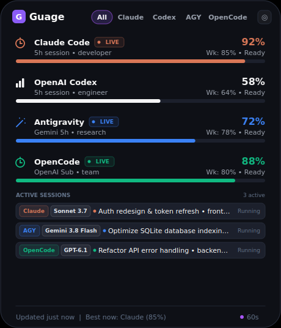
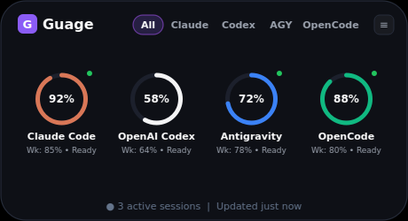
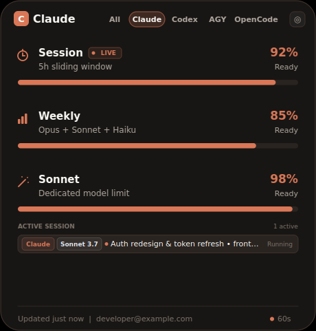
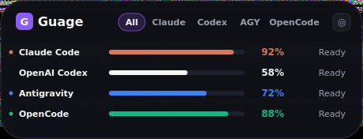
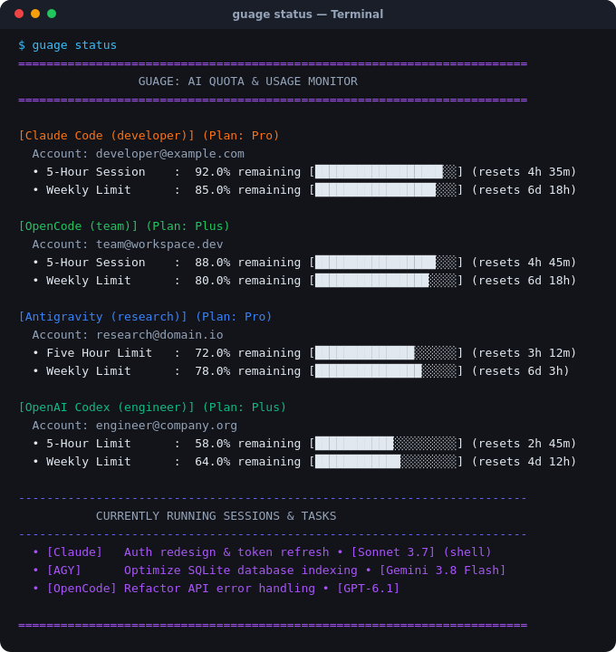

# Guage — AI Usage, Quotas & Running Sessions Monitor

<p align="center">
  
</p>

A modern, ultra-lightweight, cross-platform desktop widget, terminal CLI, and **Model Context Protocol (MCP) Server** for monitoring real-time quotas, rolling 5-hour session limits, weekly caps, countdown reset timers, model badges, and active running agent sessions across **Claude Code**, **OpenAI Codex**, **Google Antigravity**, and **OpenCode**.

---

## Highlights & Features

### 1. Multi-Provider Quota Tracking
- **Claude Code**: 5-hour sliding session window %, weekly quota pool %, dedicated Sonnet limits, per-model consumption (Opus 5.5, Sonnet 5.5, Haiku), and plan tier (`Pro` / `Team` / `Enterprise`).
- **OpenAI Codex**: Primary 5-hour rolling limit %, secondary weekly cap %, reserve models (`gpt-6.1-sol`, `gpt-6-astra`, `gpt-5.6-luna`), and plan tier (`Plus` / `Team` / `Pro`).
- **Google Antigravity (AGY)**: Gemini models (3.8 Flash, 3.1 Pro) 5h & weekly pools, 3rd-party models (Claude Opus/Sonnet, GPT-OSS) sliding windows, and credits balance.
- **OpenCode**: Autonomous task limits, multi-provider credentials (OpenAI Plus OAuth, Anthropic Claude, OrcaRouter API), and session utilization.

### 2. Live Running Tasks & Active Session Badges
- **Real-Time Discovery**: Tracks running background sessions, interactive shells, and autonomous rollout tasks via process cmdline analysis, lock files, and database verification.
- **Compact Model Badges**: Displays short model identifiers on each running bar (`[Sonnet 5.5]`, `[Opus 5.5]`, `[GPT-6.1]`, `[Gemini 3.8 Flash]`).
- **Display Modes**:
  - **Bars Mode**: Shows separate styled cards for each active task.
  - **Cycled Mode**: Shows a single sleek rotating status ticker for all running sessions.
- **Live Metrics**: Elapsed duration timers (`14m • running`), pulse status dots, working directory tags, and right-click session inspector.

### 3. Agent Connector & MCP Server (Model Context Protocol)
- **Built-in Standard MCP Server**: Enables **any AI coding agent** (Claude Code, Antigravity, OpenCode, Cursor, Windsurf) to query remaining limits, active sessions, and optimal provider recommendations via JSON-RPC 2.0 over `stdio`.
- **Exposed MCP Tools**:
  - `get_remaining_limits`: Returns remaining quota %, reset countdowns, and severity.
  - `get_active_sessions`: Returns all currently running tasks and their active models.
  - `get_quota_recommendation`: Recommends which provider has the most available headroom right now.
  - `get_model_allowances`: Returns granular per-model quotas and sub-limits.
- **MCP Resources**: `limits://current` and `limits://sessions`.
- **Direct Terminal Handover Command (`ai-limits`)**: Any terminal-based agent or bash script can execute `ai-limits` or `ai-limits --sessions` to immediately inspect limits.

### 4. Interactive Desktop UI
- **Multiple View Modes**:
  - **Bars View**: Segmented progress bars with secondary weekly percentages and reset countdowns.
  - **Rings View**: Circular gauges with brand accents and live pulse indicators.
  - **Mini Dock View**: Ultra-compact desktop pill for minimalist setups.
- **Provider Switching**: Click tabs (`All`, `Claude`, `Codex`, `AGY`, `OpenCode`) to focus on a specific provider or view the unified dashboard.
- **Used vs. Remaining Toggle**: Switch anytime between remaining quota and used quota.
- **24h Trend Sparkline**: Visualizes remaining quota trajectory and local daily token consumption.
- **System Tray Integration**: Minimize to tray, global shortcuts, always-on-top toggle, and position memory.

---

## Screenshots & Gallery

| Detailed Bars View | Circular Rings View |
| :---: | :---: |
|  |  |
| **Single Provider Focus (Claude)** | **Mini Dock View** |
|  |  |

<p align="center">
  <b>Terminal CLI Monitor (<code>guage status</code>)</b><br>
  
</p>

---

## Installation & Setup

### Prerequisites
- Python 3.10 or higher
- Linux (X11 / Wayland) or Windows 10/11

### 1. Clone & Set Up Virtual Environment

```bash
# Clone the repository
git clone https://github.com/evoziosk/guage.git
cd guage

# Using uv (recommended)
uv venv .venv
source .venv/bin/activate  # On Windows: .venv\Scripts\activate
uv pip install -e .

# Or using standard python venv
python3 -m venv .venv
source .venv/bin/activate  # On Windows: .venv\Scripts\activate
pip install -e .
```

### 2. Verify Installation
Run the test suite to verify all collectors, models, and UI components:
```bash
pytest
```

---

## Running the Application

### 1. Unified `guage` CLI

The application provides a unified `guage` CLI for both desktop and terminal workflows:

```bash
# Launch the desktop GUI widget
guage

# Display live terminal table of allowances, burn rate & active sessions
guage status

# View currently running coding sessions across AI tools
guage sessions

# View markdown limits report and best provider recommendation
guage limits

# Output structured JSON (e.g. for Waybar, Polybar, or scripts)
guage status --json

# Force bypass local caches
guage status --force
```

### 2. Desktop GUI Widget Controls
- **Drag**: Left-click and drag anywhere on the widget to reposition. Snaps to screen edges.
- **Toggle View**: Click the top-right mode icon (`≡` / `◎`) or use the tray menu to switch between **Bars**, **Rings**, and **Mini** views.
- **Provider Switching**: Click tabs (`All`, `Claude`, `Codex`, `AGY`, `OpenCode`) to focus on a specific provider.
- **Active Session Badges**: Click any active session bar to quickly jump to that provider.
- **Right-Click Menu**: Quick access to view modes, sessions display (separate bars vs. cycling status ticker), always-on-top, and refresh.

---

## Agent Connector & MCP Integration

Guage includes a full Model Context Protocol (MCP) server so coding assistants (Antigravity, Claude Code, OpenCode, Cursor, Windsurf) can monitor their remaining quotas and active sessions.

### Auto-Installation
Run the auto-installer to register Guage with all local agent clients:
```bash
guage mcp --install-all
```
This automatically registers the MCP server into:
- **Google Antigravity**: `~/.gemini/config/mcp_config.json`
- **Claude Code**: `~/.claude.json`
- **OpenCode**: `opencode.json`

### Manual MCP Server Configuration
For Cursor, Windsurf, Claude Desktop, or custom tools, add the following to your agent's MCP config:

```json
{
  "mcpServers": {
    "guage": {
      "command": "python",
      "args": ["-m", "src.mcp_server"]
    }
  }
}
```

---

## Building Standalone Binaries

### Packaging for Windows (`.exe`)
To create a standalone executable that runs without requiring Python installed:
```powershell
pip install pyinstaller
pyinstaller --noconsole --name "ModelPulse" --icon=assets/icon.ico src/main.py
```
The output executable will be generated at `dist/ModelPulse.exe`.

### Packaging for Linux (PyInstaller ELF)
```bash
pip install pyinstaller
pyinstaller --noconsole --name "modelpulse" src/main.py
```
The standalone binary will be generated at `dist/modelpulse`.

---

## Configuration

Settings and caches are stored according to standard OS conventions:

| Configuration Item | Linux Path | Windows Path |
| :--- | :--- | :--- |
| **Settings File** | `~/.config/ai-usage-widget/settings.json` | `%APPDATA%\ai-usage-widget\settings.json` |
| **Usage Cache** | `~/.cache/ai-usage-widget/` | `%LOCALAPPDATA%\ai-usage-widget\` |
| **Antigravity MCP** | `~/.gemini/config/mcp_config.json` | `%USERPROFILE%\.gemini\config\mcp_config.json` |
| **Claude Code MCP** | `~/.claude.json` | `%USERPROFILE%\.claude.json` |

### Key `settings.json` Options:
```json
{
  "show_active_sessions": true,
  "session_display_mode": "bars",
  "view_mode": "bars",
  "show_used": false,
  "always_on_top": false,
  "poll_interval_claude": 60,
  "poll_interval_codex": 120,
  "poll_interval_antigravity": 120,
  "poll_interval_opencode": 60
}
```

---

## Status Bar Integration (Waybar / Polybar)

To embed live quotas into your Linux status bar:

### Waybar Configuration (`~/.config/waybar/config`)
```json
"custom/modelpulse": {
    "format": "󰚩 {}",
    "exec": "/home/youruser/desktop_widget/.venv/bin/python -m src.cli --json",
    "return-type": "json",
    "interval": 60,
    "tooltip": true
}
```

---

## License

MIT License. Designed and developed for seamless AI pair-programming monitoring.
